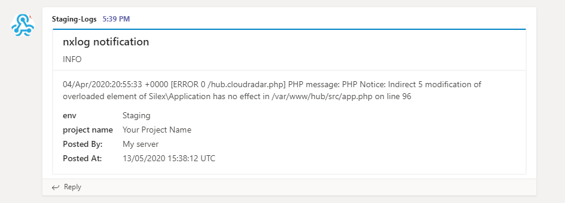
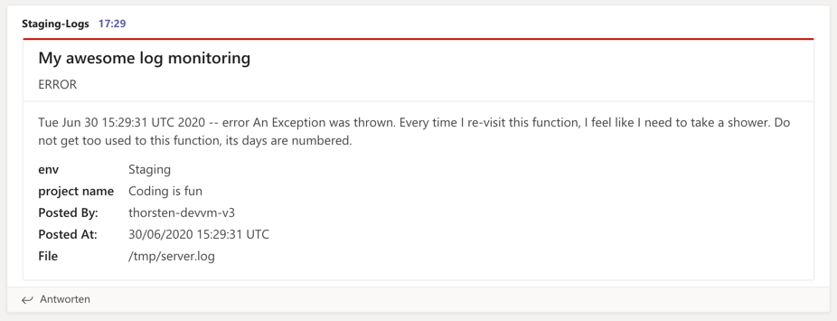

## mst-sender.py 

### What it is for 

The script sends a notification message in form of a MS Teams Message Card.
<br>
It could be also easily integrated with [nxlog](https://nxlog.co/). 
<br>

_It works with Python 3 only._

Notification example received in MS Teams with the `INFO` severity:



### How to create a Webhook url in MS Teams
[Follow this instruction](https://docs.microsoft.com/en-us/microsoftteams/platform/webhooks-and-connectors/how-to/connectors-using#setting-up-a-custom-incoming-webhook)

### How to install
##### Windows
* Have a Python installed with python [requests](https://requests.readthedocs.io/en/master/)
* Download `mst-sender` python script along with `mst-sender.cfg.sample`
* Rename `mst-sender.cfg.sample` to `mst-sender.cfg` and paste your MS Teams Web Hook Url into it: `webhook_url = `
* Send a test message 

```
python3 mst-sender.py --severity ERROR --message "Test from Windows" --profile production
```

##### Linux
* Have a Python installed
* Install python [requests]([requests](https://requests.readthedocs.io/en/master/)) `sudo apt-get install -y python-requests`.
* Pull ms-sender script onto the server 
```
wget https://raw.githubusercontent.com/cloudradar-monitoring/mst-sender/master/mst-sender.py \
  -O /usr/local/bin/mst-sender \
  && chmod +x /usr/local/bin/mst-sender
```
* Pull the configuration file onto the server 
```
mkdir /etc/mst-sender
wget https://raw.githubusercontent.com/cloudradar-monitoring/mst-sender/master/mst-sender.cfg.sample \ 
-O /etc/mst-sender/mst-sender.cfg
```
* Enter your MS Teams Web Hook Url in `mst-sender.cfg` as `webhook_url = ` in the `[production]` profile. 
* Send a test message

```
/usr/local/bin/mst-sender3 --message "Test from Linux" --profile production
```

### General usage

#### Configuration - mst-sender.cfg

```bash
[default]
# Enter your web hook url created on MS Teams
webhook_url = https://outlook.office.com/webhook/<YOUR_TOKEN>

# Specify a severity, can be overridden by '--severity'
# The severity determines the color of the message.
# ERROR, WARNING or INFO
severity = ERROR

# Optionally specify who should appear as sender.
# If not given, the local hostname is used.
# Can be overridden by --sender
sender = My server

# You can append any facts to the message. Optional.
# Format fact.FACT_NAME ie. fact.Project Name = Your Project Name fact becomes 'Project Name: Your Project Name'
fact.Env = Staging
fact.Project Name = Your Project Name
```

#### Command line options:
* `--profile` - the profile you plan to use in `mst-sender.cfg` ie `--profile production`
* `--sender`  - a notification sender, to determine who should appear as a sender 
* `--message` - a message which is posted to MS Teams
* `--title`   - a card message title 
* `--severity` - the notification severity (INFO, ERROR, WARNING)
* `--config` - a directory where `mst-sender.cfg` sits (a current working directory of the script used as a fallback)

Examples:

```
# Send a test message with a severity of ERROR using [production] profile from mst-sender.cfg
python /usr/local/bin/mst-sender --severity ERROR --message "Test from ubuntu" --profile production --config /etc/mst-sender

# Send a test message with a severity of INFO using [default] profile from mst-sender.cfg
python /usr/local/bin/mst-sender --severity INFO --message "Test from ubunt" --config /etc/mst-sender

# Send a test message with a severity of WARNING using [default] profile from mst-sender.cfg
# as a message sender Developer is used; the card title reads I AM A NEW TITLE
python3 C:\\mst-sender\\mst-sender.py --severity WARNING --message "Test from Windows - Python3" --config C:\\mst-sender --sender Developer --title "I AM A NEW TITLE"
```

#### Reading from pipes
`mst-sender` also supports reading the message from stdin, if no message is given by `--message`. Specifying options while reading from stdin is supported. 
```bash
echo "This is my message"|mst-sender
echo "This is my message"|mst-sender --severity ERROR --profile example
```
One additional fact can be injected via the message itself by using square brackets and an equal sign. It's removed from the message and appended to the existing facts.
```bash
echo "[Logile=/tmp/app.log]An error occured in your app"|mst-sender
```
This creates the following fact
```json
{ "name": "Logfile", "value": "/tmp/app.log" }
``` 

## Integrate mst-sender with NX Log
 
#### Windows 

* Install and configure `mst-sender` (see above for instruction)
* Download and install nxlog-ce (or Enterprise edition) [download](https://nxlog.co/products/nxlog-community-edition/download)
* Edit your nxlog configuration file found in `C:\Program Files (x86)\nxlog\conf` (or `C:\Program Files\nxlog\conf`) and add the following code (assuming `--profile` is `[default]`):

```bash
<Extension _exec>
    Module  xm_exec
</Extension>

<Input in>
    Module  im_file
    File    "D:\\mst-sender\\sample\\test.log"
        <Exec>
        if $raw_event =~ /(\S+)\ (.+) \[ERROR (.+)/
        {
            exec_async("C:\\Python3\\python.exe", "D:\\mst-sender\\mst-sender.py", "--severity", "ERROR", "--message", $raw_event);
        }
        if $raw_event =~ /(\S+)\ (.+) \[WARNING (.+)/
        {
            exec_async("C:\\Python3\\python.exe", "D:\\mst-sender\\mst-sender.py", "--severity", "WARNING", "--message", $raw_event);
        }
        </Exec>
</Input>

<Output out1>
    Module  om_null
</Output>

<Route 1>
    Path    in => out1
</Route>
```
where:
```
C:\\Python3\\python.exe (C:\\Python36\\python.exe) - path to your python3 installation
D:\\mst-sender\\test\\test.log - log file being monitored by nxlog
```

* Restart `nxlog` service
* Verify if it works; add a couple of ERROR, WARNING lines in `test.log`. You should get notifications in MS Teams

#### Linux (Ubuntu)
* Install and configure `mst-sender` (see above for instruction)
* Download nxlog [download](https://nxlog.co/products/nxlog-community-edition/download)
* Transfer the file to the target server scp or a similar secure method 
* Install nxlog packadges ie. `sudo dpkg -i nxlog-ce_2.10.2150_ubuntu_xenial_amd64.deb` [nxlog installation manual](https://nxlog.co/documentation/nxlog-user-guide/deploy_debian.html)
* Verify the installation works `nxlog -v`
* Pull the test log file onto the server `wget https://raw.githubusercontent.com/cloudradar-monitoring/mst-sender/master/sample/test.log -O /etc/mst-sender/test.log`
* Edit `nxlog.conf` in `/etc/nxlog`

```bash
<Extension _exec>
    Module  xm_exec
</Extension>

<Input in>
    Module  im_file
    File    "/etc/mst-sender/test.log"
        <Exec>
        if $raw_event =~ /(\S+)\ (.+) \[ERROR (.+)/
        {
            exec_async("/usr/bin/python", "/usr/local/bin/mst-sender", "--severity", "ERROR", "--message", $raw_event, "--config", "/etc/mst-sender/", "--profile", "production");
        }
        if $raw_event =~ /(\S+)\ (.+) \[WARNING (.+)/
        {
            exec_async("/usr/bin/python", "/usr/local/bin/mst-sender", "--severity", "WARNING", "--message", $raw_event, "--config", "/etc/mst-sender/", "--profile", "production");
        }
        </Exec>
</Input>

<Output out1>
    Module  om_null
</Output>

<Route 1>
    Path    in => out1
</Route>
```

* restart nxlog `sudo systemctl restart nxlog`
* Verify if it works; append a couple of ERROR, WARNING lines in `test.log`. You should get notifications in MS Teams ie.
```
echo "01/May/2020:20:55:33 +0000 [WARNING 0 /hub.cloudradar.php] PHP message: PHP Notice:  Indirect 2 modification of overloaded element of Silex\Application has no effect in /var/www/hub/src/app.php on line 96" >> test.log
echo "01/May/2020:20:55:33 +0000 [ERROR 0 /hub.cloudradar.php] PHP message: PHP Notice:  Indirect 2 modification of overloaded element of Silex\Application has no effect in /var/www/hub/src/app.php on line 96" >> test.log
```
#### Advanced integration into Nxlog
The above examples are simple and not suitable if you want to monitor many files. You would end up with a lot of duplicated configuration blocks.
Instead of putting everything inside an Input Block you should define mst-sender as an output channel. For example
``` 
<Output msteams>
    Module om_exec
    Command /user/local/bin/mst-sender
    Arg --title
    Arg My awesome log monitoring
    Exec    if not ($raw_event =~ /error/) drop();
</Output>
```
This allows you to use the "msteams output" for many logfile you supervise. Here is a full example.
```
<Output msteams>
    Module om_exec
    Command /usr/local/bin/mst-sender
    Arg --title
    Arg My awesome log monitoring
    Exec    if not ($raw_event =~ /error/) drop();
</Output>

<Input applog>
    Module im_file
    File "/tmp/app.log"
    <Exec>
      $raw_event = "[File=/tmp/app.log]" + $raw_event;
    </Exec>
</Input>
<Input serverlog>
    Module im_file
    File "/tmp/server.log"
    <Exec>
       if not ($raw_event =~ /Exception/) drop();
       $raw_event = "[File=/tmp/server.log]" + $raw_event;
    </Exec>
</Input>
<Route myLogging>
    Path applog,serverlog => msteams
</Route>
```
This example defines two files supervised by NXlog. The route defines that messages from both are sent to msteams.
Note that filtering is done at two levels. NXlog takes every new entry from the `/tmp/app.log` file and sends it to the msteams output.
From the `/tmp/server.log` only entries containing the keyword `exception` are forwarded to the msteams output. 

The output does more filtering discarding all messages not containing the keyword `error`. 

All matching is case sensitive. The `/i` modifier does case insensitive matching. For example `if not ($raw_event =~ /exception/i) drop();`



**Don't flood your chat with repeated messages.**
Some errors in a very basic function can produce tons of log entries, sometimes thousands per second. This would flood your chat and the MS Teams API will very likely ban our rate limit you.
NXlog can track repeated messages and suppress them by maintaining internal counters for each message. But as long as the message picked up from some log file contains a date and time, NXlog doesn't consider the messages as identical.
So first you must remove the date, by creating a filter. Below is an example of how to cut off the date of an PHP Monolog message. The message typically starts with
```
[2020-06-30 10:40:07] hub.myproject.ERROR: Uncaught Exception TypeError: "Argument 1 passed to hub\Helpers\CK::hostData() must be of the type string, null given ...
```
In your nxlog config create a filter like this and put it into the route. Adjust the regex to your needs. 
``` 
<Processor removeDate>
    Module pm_null
    <Exec>
        if ($raw_event =~ /\[.*?\] (.*)/) $raw_event = $1;
    </Exec>
</Processor>
<Route myLogging>
    Path applog,serverlog => removeDate => msteams
</Route>
```
With this in place, the date is removed. Don't worry, the `mst-sender` script adds the date as a fact again. 

Now create a counter and dop repeated messages.
``` 
<Processor norepeat>
  Module pm_null
  <Exec>
  if defined get_stat($raw_event) {
    add_stat($raw_event, 1);
  } 
  else {
    create_stat($raw_event, 'COUNT', 10, now(), 10);
  }
  if get_stat($raw_event) > 2 drop();
  </Exec>
</Processor>
<Route myLogging>
    Path applog,serverlog => removeDate => norepeat => msteams
</Route>
```
This example creates a counter with a lifetime of 10 seconds, increments it by one for every repeated messages, and drops messages after the third repetition. [Learn more about counters](https://nxlog.co/documentation/nxlog-user-guide-full#core_proc_create_stat) or [Download the full example](./sample/nxlog_om_exec.conf)